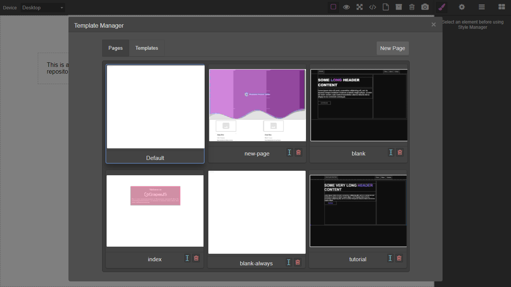

# Grapesjs Template Manager

>(WIP)Pending some error fixes and feature implementations .Requires GrapesJS v0.14.15 or higher

Template and page manager for grapesjs



### HTML
```html
<link href="https://unpkg.com/grapesjs/dist/css/grapes.min.css" rel="stylesheet">
<link href="https://unpkg.com/grapesjs-template-manager/dist/grapesjs-template-manager.min.css" rel="stylesheet">
<script src="https://unpkg.com/grapesjs"></script>
<script src="https://unpkg.com/grapesjs-template-manager"></script>

<div id="gjs"></div>
```

### JS
```js
const editor = grapesjs.init({
  container: '#gjs',
  height: '100%',
  fromElement: true,
  storageManager:  {
    type: 'indexeddb',
    // ...
  },
  plugins: ['grapesjs-template-manager'],
});

// Running commands from panels
const pn = editor.Panels;
const panelOpts = pn.addPanel({
  id: 'options'
});
panelOpts.get('buttons').add([{
  attributes: {
    title: 'Open Templates'
  },
  className: 'fa fa-file-o',
  command: 'open-templates',//Open modal 
  id: 'open-templates'
}, {
  attributes: {
    title: 'Save As Template'
  },
  className: 'fa fa-archive',
  command: 'save-as-template',//Save page as template
  id: 'save-as-template'
}, {
  attributes: {
    title: 'Delete Template'
  },
  className: 'fa fa-trash-o',
  command: 'delete-template',//Delete open page or template
  id: 'delete-templates'
}, {
  attributes: {
    title: 'Take Screenshot'
  },
  className: 'fa fa-camera',
  command: 'take-screenshot',//Take an image of the canvas
  id: 'take-screenshot'
}]);
```

### CSS
```css
body, html {
  margin: 0;
  height: 100%;
}
```


## Summary

* Plugin name: `grapesjs-template-manager`
* Commands
    * `open-templates`
    * `get-uuidv4`
    * `take-screenshot`
    * `save-as-template`
    * `delete-template`
* Storages
    * `indexeddb`
    * `firestore`
    * `rest-api`

> This plugin uses the [`<foreignObject>`](https://developer.mozilla.org/en-US/docs/Web/SVG/Element/foreignObject) [SVG](https://developer.mozilla.org/en-US/docs/Web/SVG) element to simulate thumbnails which works well for projects which do not use any external stylesheets such as bootstrap. If your pages rely on external stylesheets you can store image thumbnails with your pages via the `take-screenshot` command which uses the [dom-to-image](https://github.com/tsayen/dom-to-image) library to generate thumbnails. You can also access this library through `editor.domtoimage`. External images may fail to render due to CORS restrictions.

## Options

| Option | Description | Default |
|-|-|-
| `dbName` | Database name | `gjs` |
| `objectStoreName` | Collection name | `templates` |
| `loadFirst` | Load first template in storage | `true` |
| `indexeddbVersion` | IndexedDB schema version | `4` |
| `onDelete` | On successful template deletion | `Function` |
| `onDeleteError` | On error template deletion | `Function` |
| `onScreenShotError` | On error capturing screenshot | `Function` |
| `quality` | Generated screenshot quality | `.01` |
| `mdlTitle` | Template modal title | `Template Manager` |
| `apiKey` | `Firebase` API key | `` |
| `authDomain` | `Firebase` Auth domain | `` |
| `projectId` | `Cloud Firestore` project ID | `` |
| `enableOffline` | Enable `Firestore` support for offline data persistence | `true` |
| `settings` | `Firestore` database settings | `{ timestampsInSnapshots: true }` |
| `uuidInPath` | Add uuid as path parameter on store for `rest-api`(useful for validation) | `true` |

* Setting `loadFirst` to `false` prevents overwritting the contents of the editor with the contents of the first template in storage.
* Only use options for `Firebase` when using `Cloud Firestore` storage.
* `dbName` and `indexeddbVersion` only apply to `indexddb` storage.
* `objectStoreName` acts as collection name for both `firestore` and ` indexeddb`.
* When `uuidInPath` is set to `false` the store request will be `http://endpoint/store/` instead of `http://endpoint/store/{uuid}`

## Local/IndexedDB

```js
window.editor = grapesjs.init({
  container: '#gjs',
  // ...
  storageManager:  {
    type: 'indexeddb'
  },
  plugins: ['grapesjs-template-manager'],
  pluginsOpts: {
    'grapesjs-template-manager': { /* Options */ }
  }
});
```

## Firestore

Configure firestore access rules for your app.
Add libraries to `head` of document:

```html
<!-- The core Firebase JS SDK is always required and must be listed first -->
<script src="https://www.gstatic.com/firebasejs/8.3.1/firebase-app.js"></script>
<!-- TODO: Add SDKs for Firebase products that you want to use
https://firebase.google.com/docs/web/setup#available-libraries -->
<script src="https://www.gstatic.com/firebasejs/8.3.1/firebase-firestore.js"></script>
```

Add credentials:

```js
window.editor = grapesjs.init({
  container: '#gjs',
  // ...
  storageManager:  {
    type: 'firestore'
  },
  plugins: ['grapesjs-template-manager'],
  pluginsOpts: {
    'grapesjs-template-manager': { 
      // Firebase API key
      apiKey: 'FIREBASE_API_KEY',
      // Firebase Auth domain
      authDomain: 'app-id-00a00.firebaseapp.com',
      // Cloud Firestore project ID
      projectId: 'app-id-00a00',
    }
  }
});
```

## Remote/REST-API

Example backend https://github.com/Ju99ernaut/gjs-api

```js
window.editor = grapesjs.init({
  container: '#gjs',
  // ...
  storageManager:  {
    type: 'rest-api',
    // the URIs below can be the same depending on your API design 
    urlStore: 'https://endpoint/store/',// POST
    urlLoad: 'https://endpoint/load/',// GET
    urlDelete: 'https://endpoint/delete/',// DELETE
    params: { _some_token: '...' },
    headers: { Authorization: 'Basic ...' }
  },
  plugins: ['grapesjs-template-manager'],
  pluginsOpts: {
    'grapesjs-template-manager': { /* options */ }
  }
});
```

## Download

* CDN
  * `https://unpkg.com/grapesjs-template-manager`
* NPM
  * `npm i grapesjs-template-manager`
* GIT
  * `git clone https://github.com/Ju99ernaut/grapesjs-template-manager.git`


## Usage

Directly in the browser
```html
<link href="https://unpkg.com/grapesjs/dist/css/grapes.min.css" rel="stylesheet"/>
<link href="https://unpkg.com/grapesjs-template-manager/dist/grapesjs-template-manager.min.css" rel="stylesheet">
<script src="https://unpkg.com/grapesjs"></script>
<script src="path/to/grapesjs-template-manager.min.js"></script>

<div id="gjs"></div>

<script type="text/javascript">
  var editor = grapesjs.init({
      container: '#gjs',
      // ...
      storageManager:  {
        type: 'indexeddb',
        // ...
      },
      plugins: ['grapesjs-template-manager'],
      pluginsOpts: {
        'grapesjs-template-manager': { /* options */ }
      }
  });
</script>
```

Modern javascript
```js
import grapesjs from 'grapesjs';
import plugin from 'grapesjs-template-manager';
import 'grapesjs/dist/css/grapes.min.css';
import 'grapesjs-template-manager/dist/grapesjs-template-manager.min.css';

const editor = grapesjs.init({
  container : '#gjs',
  // ...
  storageManager:  {
    type: 'indexeddb',
    // ...
  },
  plugins: [plugin],
  pluginsOpts: {
    [plugin]: { /* options */ }
  }
  // or
  plugins: [
    editor => plugin(editor, { /* options */ }),
  ],
});
```


## Development

Clone the repository

```sh
$ git clone https://github.com/Ju99ernaut/grapesjs-template-manager.git
$ cd grapesjs-template-manager
```

Install dependencies

```sh
$ npm i
```

Build css or watch scss

```sh
$ npm run build:css
```

`OR`

```
$ npm run watch:scss
```

Start the dev server

```sh
$ npm start
```

Build the source

```sh
$ npm run build
```


## License

MIT
